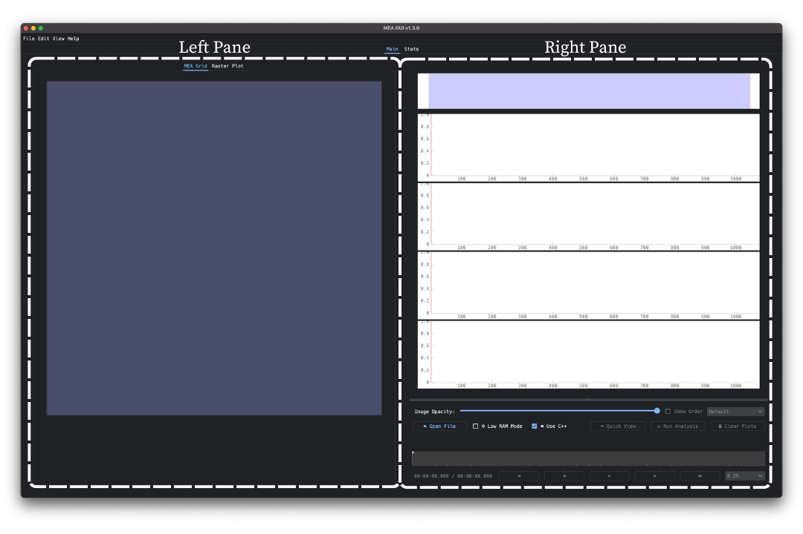
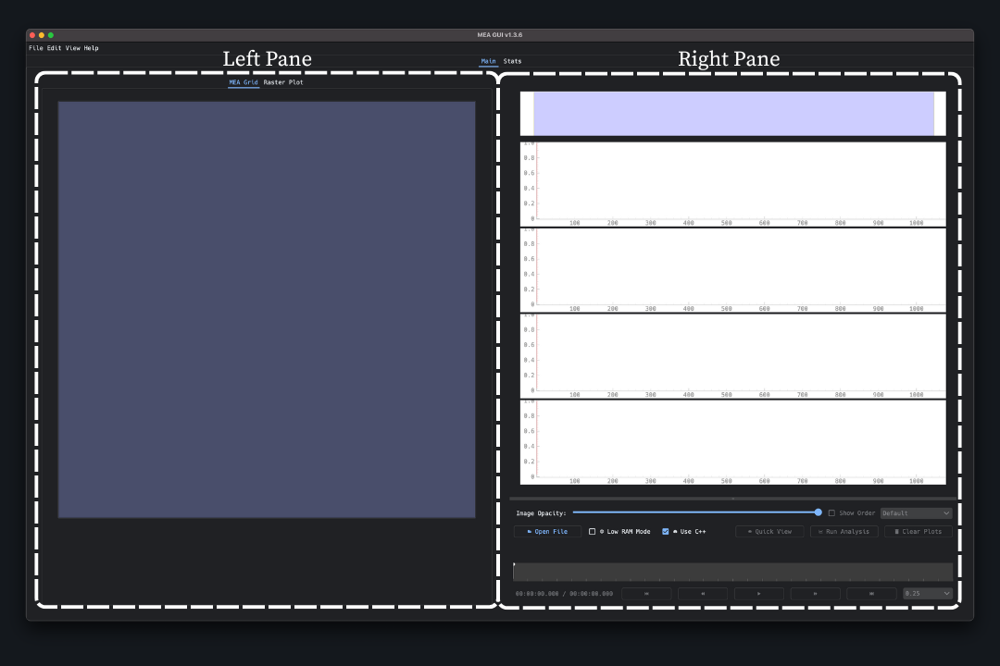

========
Main Tab
========

.. toctree::
  :maxdepth: 1
  :hidden:

  leftpane
  rightpane

The Main tab is the first window that appears when you start the program.
It is divided into two panes, the left pane and the right pane.
The left pane is further subdivided into two tabs, the ``MEA Grid`` tab and the ``Raster Plot`` tab.
The right pane contains the mini map, four trace plots, and useful actions and settings for analysis.

