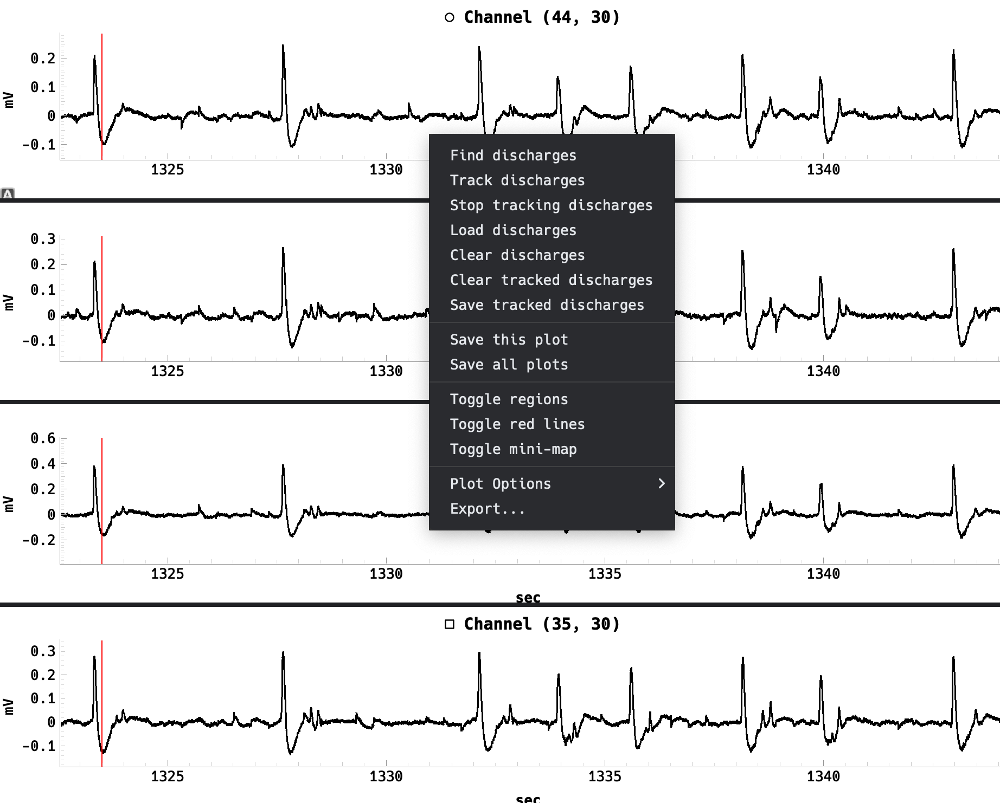

==========
Right Pane
==========

Mini-map
========
The mini-map appears above the four trace plots. When the user hovers over one of the trace plots, the corresponding channel is highlighted on the mini-map along with the current visible region if zoomed in.
The user may drag the visible region on the mini-map to change the visible region on the trace plots. 
The visibility of the mini-map can be toggled in the View menu or by right clicking on one of the trace plots and selecting "Toggle mini-map".

.. image:: ../../../_static/mini-map.gif
   :alt: Mini-map
   :align: center
   :width: 600px

Trace Plots
===========
Just under the mini-map are four trace plots which display the signal data of selected active channels. 
Despite numerous optimizations, mouse interactions with the trace plots may be slow when displaying a large number of samples.

.. warning::
   If the user is experiencing slow performance, it is recommended to reduce the number of samples displayed in the trace plots by zooming in. This is especially relevant when the MEA grid animation is currently running or when the trace plots' viewports are locked to the playhead.

For convenience and unlike the :ref:`raster_plot`, the trace plots mouse interaction is set to rectangle selection by default.
The controls for mouse interaction are as follows:

  - ``Left click`` and drag to zoom into a region of interest.
  - ``Shift`` + ``left click`` and drag to pan the view
  - ``Right click`` and drag to zoom

    - Dragging left and right zooms in/out horizontally
    - Dragging up and down zooms in/out vertically

  - Hover + ``s`` will "seek" the playhead to the current mouse position
  - Pressing ``l`` will toggle locking the view to the playhead (see warning above)
  - Clicking the ``A`` button in the bottom left corner will reset the view to the full signal range
  - If :ref:`seizure_regions` are visible, clicking on a region will zoom into that region and place the playhead at the start of the region
  - Hold ``g`` to measure the time difference between two points on the trace plots

Context Menu
------------

Right clicking on any of the four trace plots will open a context menu with useful options.
For organizational purposes, we will ignore the first section of actions, which are related to the :ref:`discharge_propagation_tracking` feature.
The remaining options are as follows:

  - **Save this plot**: Saves the current trace plot as a PNG/SVG image
  - **Save all plots**: Saves all four trace plots as PNG/SVG images
  - **Toggle regions**: Toggles the visibility of the :ref:`seizure_regions`
  - **Toggle red lines**: Toggles the visibility of the playheads on the trace plots
  - **Toggle mini-map**: Toggles the visibility of the mini-map

.. note::
   When saving the trace plots as images, the scale is set to 4. Higher scales will result in higher resolution images but will take longer to generate and may consume more memory.

Control Panel
=============
.. image:: ../../../_static/control_panel.png
   :alt: Control Panel
   :align: center
   :width: 100%

The control panel is located below the trace plots and contains various controls for the user to load and interact with the data.

Image Opacity
-------------
If an image is chosen when opening a ``.brw`` file, the image is not visible on the MEA grid, but the ``Image Opacity`` slider will be enabled to adjust the opacity of the image.

Order of Entrance
-----------------
Just to the right of the ``Image Opacity`` slider is a ``Show Order`` combo box and a dropdown menu. 
If an analysis as been run and there are seizure/SE events within the trace, these two controls will allow the user to see the order of entrance into a seizure/SE event.
The ``Show Order`` combo box will display numbers on the MEA grid corresponding to the order of entrance into a seizure/SE event.
If, instead, the raster plot is displayed, the dropdown menu will change the :ref:`row_order` of the raster plot.

Open File
---------
The ``Open File`` button simply allows the user to open a ``.brw`` file.
After selecting a ``.brw`` file, an attempt will be made to load the corresponding image file if it exists and is in the same directory.
If the image file is not found, the user will be prompted to select an image file to load.

Low RAM Mode
------------
On certain systems, the application may run out of memory when loading large files.
If ``Low RAM Mode`` is enabled, the application will attempt to load the file with less memory usage at the cost of slower performance.

.. important::
   Under the hood, the application uses two implementations of the same algorithm: one is written in MATLAB and the other in C++.
   The ``Low RAM Mode`` option will use the MATLAB implementation, so a valid MATLAB installation is required to use this feature.
   See :ref:`configuration` for more information.

Use C++
-------
For reasons beyond the scope of this documentation, the C++ implementation of the viewing/analysis algorithms is significantly faster than the MATLAB implementation.
It is highly recommended to use the C++ implementation when only viewing data and not running analysis as it will quickly load large files and display the data with minimal delay.
The C++ implementation uses much less memory than the MATLAB implementation, so it is recommended to use this option when running out of memory.

.. caution::
  The C++ implementation is not entirely true to the MATLAB implementation, so the results of the analysis may differ slightly.
  If the user is running analysis and wants the most accurate results, it is recommended to use the MATLAB implementation despite the slower performance.

.. note::
   On Windows systems, the C++ implementation locks the UI thread, so the application may appear to be unresponsive while loading files.

.. _quick_view:

Quick View
----------
The ``Quick View`` buttom will simply read the loaded file's signal data without running any analysis for a quick preview of the data.
When using the C++ implementation, this should only take a few seconds to load the data.

.. _run_analysis:

Run Analysis
------------
The ``Run Analysis`` button reads and loads the signal data just like the ``Quick View`` button, but it also runs the analysis on the data.
The analysis will detect and display seizure/SE events on the MEA grid and raster plot, as well as display the :ref:`seizure_regions` on the trace plots.

Clear Plots
-----------
Clears all plots and selected channels.

Playback Controls
-----------------

The playback controls are located at the bottom of the control panel and allow the user to play the MEA grid animation.
The controls should be self-explanatory, but here are a few notes:

  - ``Space bar`` will toggle play/pause
  - ``Left arrow`` and ``right arrow`` will move the playhead back and forward by one step determined by the current playback speed
  - ``Up arrow`` and ``down arrow`` will increase and decrease the playback speed
  - The outer buttons will jump to the start of the next or previous seizure/SE event
  - ``m`` will place a marker at the current playhead position

.. note::
   The slowest playback speed is dependent on the sampling rate.
