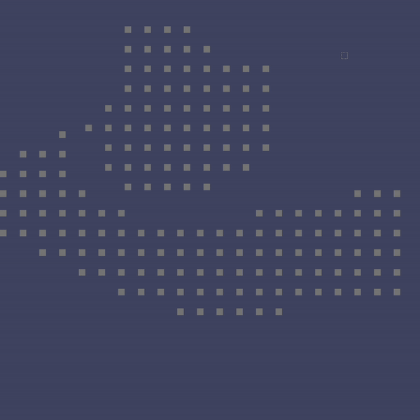
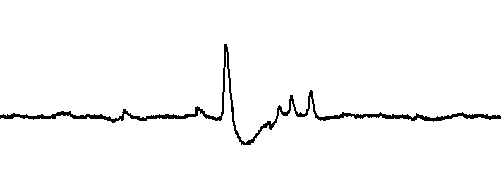
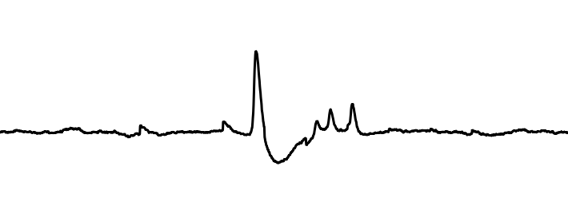
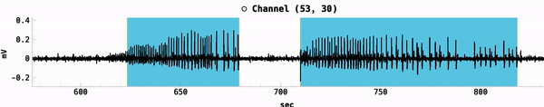
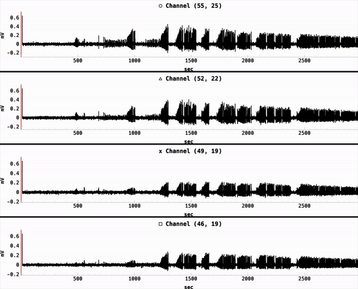

.. _menu_bar:

========
Menu Bar
========

The menu bar is located at the top of the application window and contains the following actions:

  - File
  - Edit
  - View
  - Help

File
====
Contains actions regarding opening and saving files.

Open File
---------
This is the main entry point for starting a new analysis. 
Clicking it will open a file selection dialog where the user can select ``.brw`` files. 
Upon selection, the application will search for an image associated with the recording.
If it doesn't find one, the user must manually select an image.

.. danger::

   Double check the supported image files and the logic for finding an image based on the recording.

Save MEA as Video
-----------------
Opens a video editor dialog where the user can save the MEA grid as a video.

.. seealso::

   Video Editor Dialog

Save MEA as PNG
---------------
Opens up a file dialog where the user can save the MEA grid as a PNG.

.. tip::

   Left clicking on the MEA grid pulls up a context menu with the option to save the MEA as a PNG or a video.

Save Channel Plots 
------------------
Opens up a file dialog where the user can save all or certain channels' plots as a PNG or SVG. It is requisite to have at least one channel plotted to enable this action.

If desired, the user can hide the red play heads by checking or unchecking the box in the dialog.

Scale refers to the size of the saved image. The default is 4. The larger the scale, the larger the file size and longer the save time.

Save MEA with Channel Plots
---------------------------
Opens up a file dialog where the user can save the MEA grid with channel plots as a PNG or SVG.

Edit
====
Contains actions for setting parameters used in the analysis.

.. _peak_settings:

Set Peak Settings
-----------------
Hovering over this action displays a window containing parameters used for a peak finding algorithm.

  - Peak Threshold: The number of standard deviations above the mean to be considered a peak.
  - Min Distance: The minimum distance between peaks measured in samples.
  - SNR Threshold: The signal-to-noise ratio threshold for an entire channel to be considered in the peak finding algorithm. This acts as a filter to remove noisy or inactive channels.

Set Spectrogram Settings
------------------------
Hovering over this action displays a window containing parameters used for generating spectrograms.

  - Chunk Size: The size of the window used to calculate the spectrogram.
  - Overlap: The amount of overlap between windows.
  - Freq Range: The range of frequencies to display in the spectrogram.

Set DBSCAN Settings
-------------------
Hovering over this action displays a window containing parameters used for the DBSCAN clustering algorithm.

  - Epsilon: The maximum distance between two samples for one to be considered as in the neighborhood of the other.
  - Min Samples: The number of samples in a neighborhood for a point to be considered as a core point.
  - Max Distance: The maximum distance a discharge centroid can travel between consecutive frames.
  - Bin Size: Same as the bin size for calculating the false color map on the MEA grid.

.. note::

   The DBSCAN algorithm is used to cluster channels actively recording a discharge event. The centroids of these clusters are used to track the propagation of the discharges.
   Max distance and bin size are not used in the clustering algorithm, but are useful for tracking the propagation of the discharges.

.. seealso::

   TODO: Link to page explaining discharge propagation tracking.

View
====
Contains actions for toggling the visibility of elements on the MEA grid and trace plots.

Legend
------
The legend appears to the left of the MEA grid and displays a very simple explanation of the colors used in the MEA grid's cells.

Spread Lines
------------
Spread lines highlight the propagation of the detected events. 
Pink lines are dedicated to the spread of seizures, while darker orange lines display the spread of SE events.

Discharge Paths
---------------
Discharge paths are the paths of the centroids of the clusters detected by the DBSCAN algorithm.

Detected Events
---------------
Detected events are displayed as colored cells on the MEA grid. Blue cells represent seizure events, while orange cells represent SE events. These events are detected using Norby's algorithm.

.. note::

   TODO: Link to page explaining Norby's algorithm. ALso probably change the wording to be more clear.

False Color Map
---------------
The false color map displays the activity of each channel in a color gradient. The color of each channel is determined by calculating the range of values within the bin size and normalizing them to a color gradient.
Blue represents low activity, while red represents high activity.

.. image:: ../../_static/false-color-map.gif
   :alt: False Color Map
   :align: center
   :width: 600px

In the image above, the false color map displays a region of high activity in the center of the neocortex (bottom region).

.. note::

    By default, both the detected events and the false color map are visible, so the colors blend together.

Mini-map
--------
The mini-map appears above the four trace plots. When the user hovers over one of the trace plots, the corresponding channel is highlighted on the mini-map along with the current visible region if zoomed in.
The user may drag the visible region on the mini-map to change the visible region on the trace plots.

.. image:: ../../_static/mini-map.gif
   :alt: Mini-map
   :align: center
   :width: 600px

Playheads
---------
On each trace plot and the raster plot, there are red play heads that indicate the current time. When exporting figures, it may be desirable to hide these play heads.

.. tip::

   When hovering over the trace plots, holding "s" will "seek" the play heads to the current mouse position. For the raster plot, clicking on a point will seek the play heads to that point.

Anti-aliasing
-------------
Anti-aliasing smooths the edges of the trace plots. For performance reasons, it is disabled by default. Enabling it considerably slows down the interaction with the trace plots.

No anti-aliasing:

With anti-aliasing:

.. _seizure_regions:

Seizure Regions
---------------
Similar to the MEA grid's detected events, the seizure regions are displayed on the trace plots with an identical color scheme. Blue regions represent seizure events, while orange regions represent SE events.

.. tip::

    While visible, the user can click on a region to scale the trace plots to that region and seek the play heads to the beginning of the region.

Spectrograms
------------
Displays the spectrogram(s) of the selected channel(s) in the trace plots. 
Instead of representing millivolts over time, the spectrogram represents the frequency content of the signal over time.
The y-axis will automatically adjust to the frequency range set in the spectrogram settings, which is limited by the Nyquist frequency.

Help
====
For now, this menu only contains a "Documentation" action that opens this user guide within the application.
